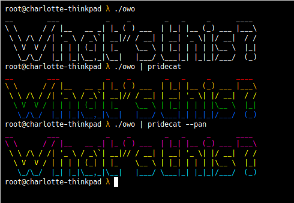

# owo
owo is a simple program that every linux user should have.

# Screenshots

# Requirements

### Language independant

* ability to sudo if you want to install it
* `make` to use the makefiles

### C
* A compiler (my makefile uses gcc)

### C++
* A compiler (my makefile uses g++)

### Assembly
&nbsp;&nbsp;&nbsp;&nbsp;&nbsp;&nbsp;<ins>X86 and X86_64</ins>

&nbsp;&nbsp;&nbsp;&nbsp;&nbsp;&nbsp;&nbsp;&nbsp;&nbsp;&nbsp;&nbsp;&nbsp;* A compiler and linker (my makefile uses nasm and ld)

&nbsp;&nbsp;&nbsp;&nbsp;&nbsp;&nbsp;<ins>Armv7l</ins>

&nbsp;&nbsp;&nbsp;&nbsp;&nbsp;&nbsp;&nbsp;&nbsp;&nbsp;&nbsp;&nbsp;&nbsp;* A compiler and linker (my makefile uses as and ld)

&nbsp;&nbsp;&nbsp;&nbsp;&nbsp;&nbsp;<ins>Aarch64</ins>

&nbsp;&nbsp;&nbsp;&nbsp;&nbsp;&nbsp;&nbsp;&nbsp;&nbsp;&nbsp;&nbsp;&nbsp;* A compiler and linker (my makefile uses gcc's aarch64 cross compiler)

### Rust
* A compiler (my makefile uses rustc)

### Python2
* Python 2

### Python3
* Python 3

### Basic
* A compiler (my makefile uses freebasic)

### Bash
* Bash

### CSharp
* A compiler (my makefile uses mcs)

# Installation

* Download the code for the language of your choice
* Run `make`
* Run `make install`

# Other Programs

- [Lolcat](https://github.com/busyloop/lolcat) - Piping owo to lolcat works really nicely
- [Pridecat](https://github.com/lunasorcery/pridecat) - Piping owo to pridecat makes it better

# Notes
All makefiles use their native environments (i.e armv7l assumes you are using an armv7l processor to compile it). 

If you wish to cross compile, that is up to you to do.

I'm not the best programmer, I don't even use c or assembly, but this is so simple anyone could do it.

It doesn't do any fancy checks to see where it can install, it just installs to /usr/bin.

It doesn't have fancy colours, command line arguments, it just prints some simple text. Please don't hurt me.

I'm not even trying to make this work in a million different languages but I get bored and it's a simple project so why not.

I develop on Linux so if it doesn't work in Windows or Mac (which the installation won't) then that's your problem not mine.
I'm not smart enough to do OS checking at install. 

I've never programmed in rust before. I just looked up how to print to the screen and guessed the rest and it worked. I don't know if there's conventions or not. Please don't hurt me for bad code :(
